# Dual VM Network Configuration and Firewall Setup

## Description
This project establishes a secure client-server network environment using VMware Workstation, demonstrating core virtualization and network security principles. Two virtual machines (VMs) are configured to simulate a client-server architecture: ServerVM serves as a gateway, while ClientVM relies on it for internet access. Network adapters are set up for seamless communication, static IP addresses are assigned using Netplan, firewall rules are implemented to secure ServerVM, and persistence scripts ensure configurations remain intact across reboots. This hands-on exercise provides valuable experience in network configuration, firewall management, and system automation.

## Setup
Install VMware Workstation from the official website and create two virtual machines running Ubuntu 22.04 LTS to establish the networked environment. Configure ServerVM with two network adapters: one for NAT to enable internet access and another for a custom VMnet2 network to communicate with ClientVM. Configure ClientVM with a single adapter on the VMnet2 network:
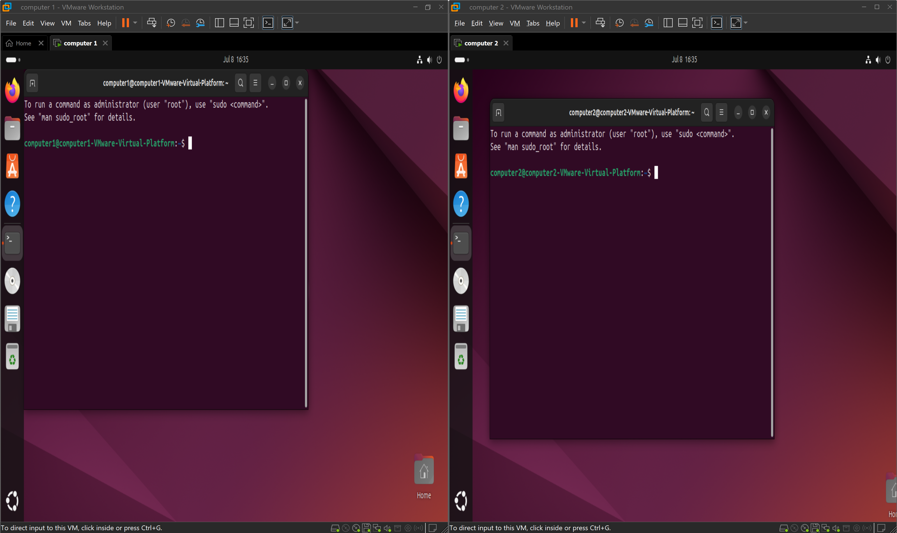
Network Adapters:
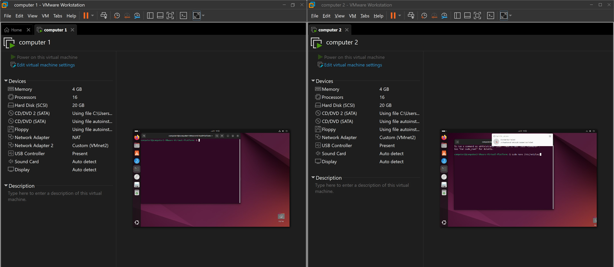

## Languages and Utilities Used
- Bash
- YAML
- VMware Workstation
- nftables
  
## Environments Used
- **Ubuntu 22.04 LTS** (for both VMs)
- **VMware Workstation**
  
## Configure YAML File
To enable ServerVM to function as a gateway, assign a static IP address to its internal network interface (ens37) and configure the NAT interface (ens33) to use DHCP. Edit the Netplan configuration file at /etc/netplan/99_config.yaml to define these settings.
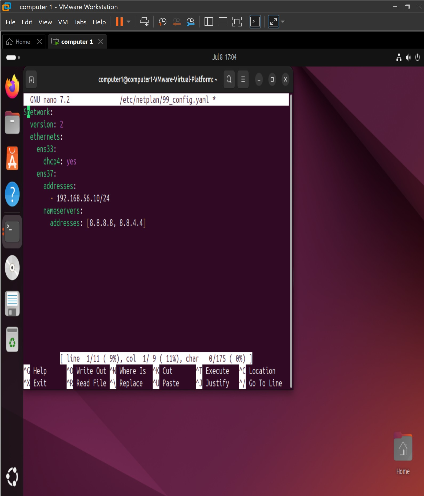

Apply the configuration using the command sudo netplan apply and verify the IP address with ip -br a.
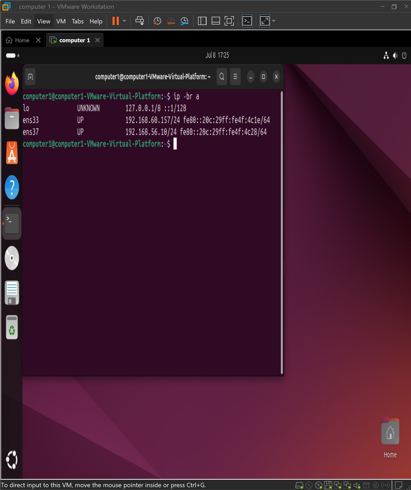

## Configure IP Forwarding
Enable IP forwarding on ServerVM to facilitate traffic routing for ClientVM. Modify the system configuration to ensure persistence by editing /etc/sysctl.conf to uncomment or add the line net.ipv4.ip_forward = 1:
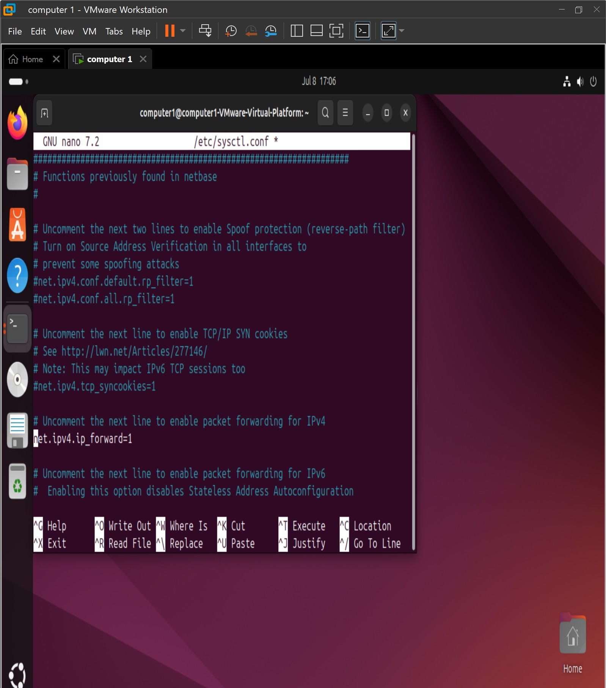
Apply the changes with the following commands: sudo sysctl -w net.ipv4.ip_forward=1
sudo nano /etc/sysctl.conf
sudo sysctl -p

## Configure nftables On Computer 1
Configure nftables on ServerVM to implement NAT masquerading and firewall rules, securing the environment while allowing necessary traffic.
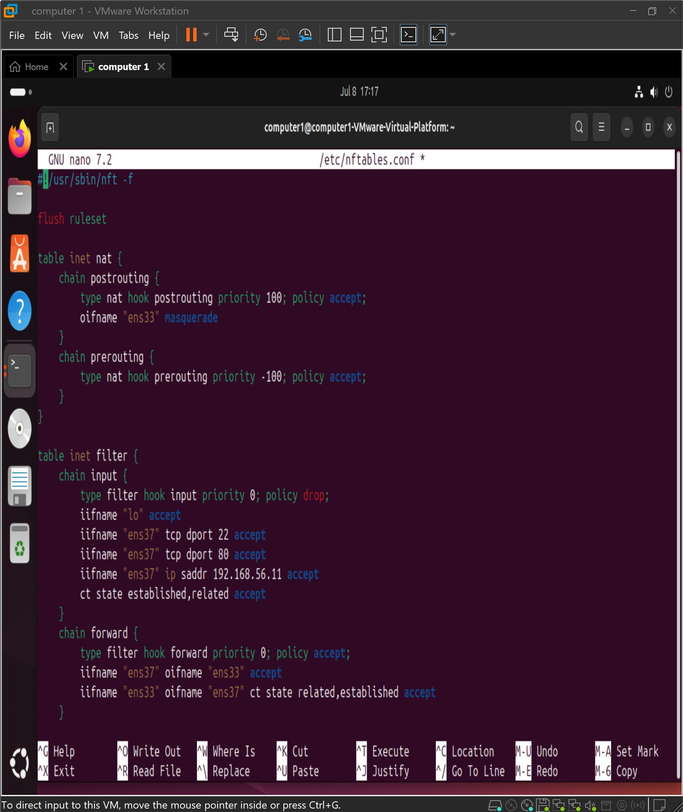

Make the configuration executable, apply the rules, and ensure persistence with the commands:
sudo chmod +x /etc/nftables.conf
sudo nft -f /etc/nftables.conf
sudo systemctl enable nftables
sudo systemctl start nftables
sudo nft list ruleset

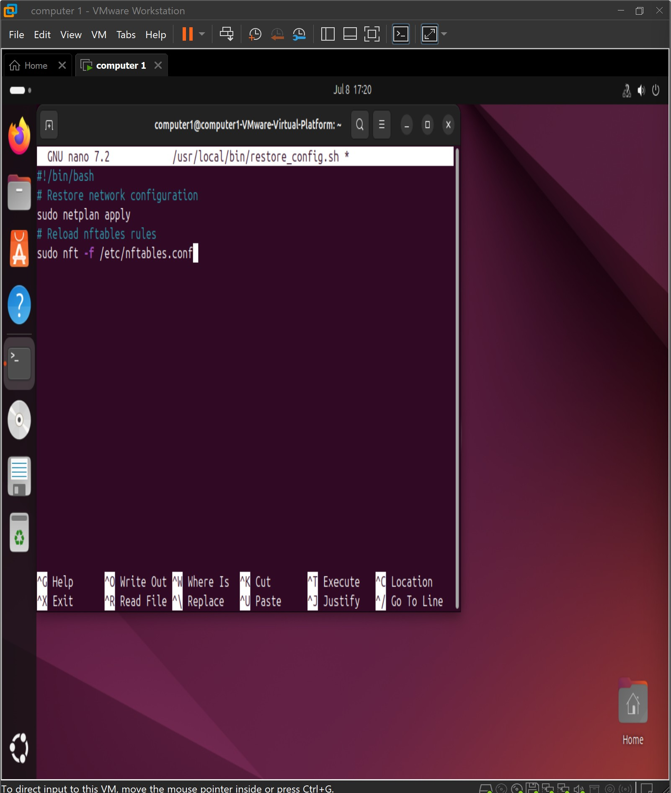
Create a persistence script to restore network and nftables settings on reboot. Make the script executable and schedule it to run at boot with:
sudo chmod +x /usr/local/bin/restore_config.sh
use sudo reboot to confirm persistent.

## Configuring Computer 2
Configure ClientVM’s network by assigning a static IP address to its internal network interface (ens37) via the Netplan configuration file at /etc/netplan/99_config.yaml:
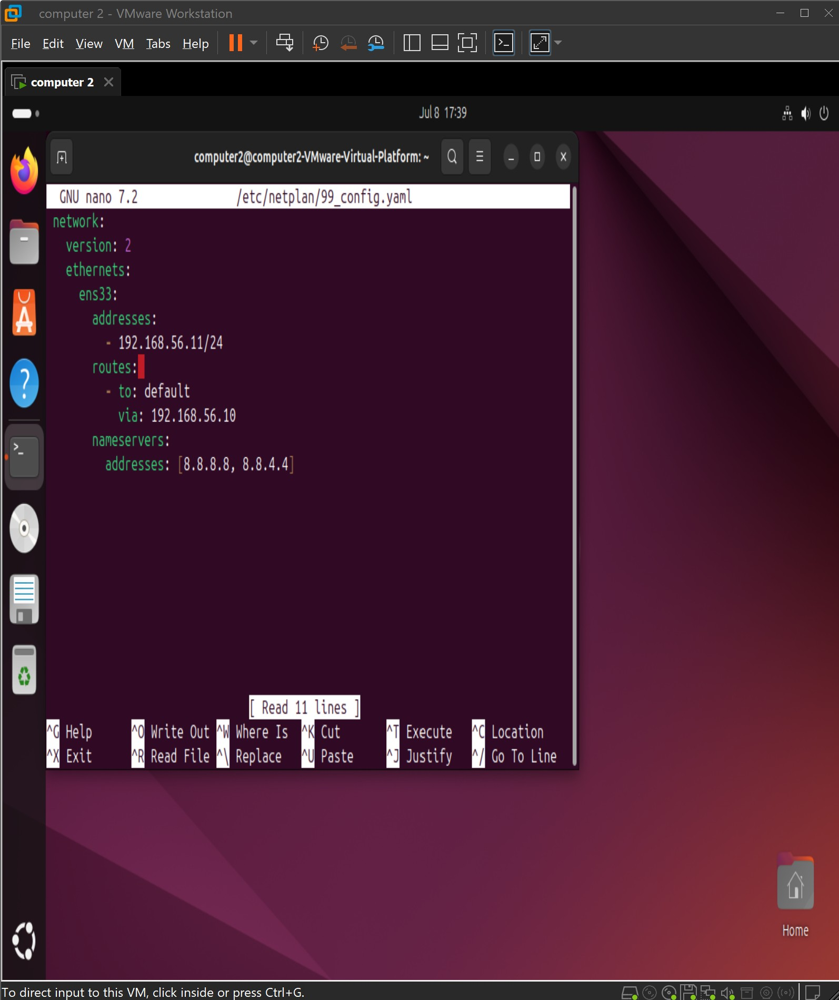

Apply the settings with sudo netplan apply and confirm the IP address using ip -br a.
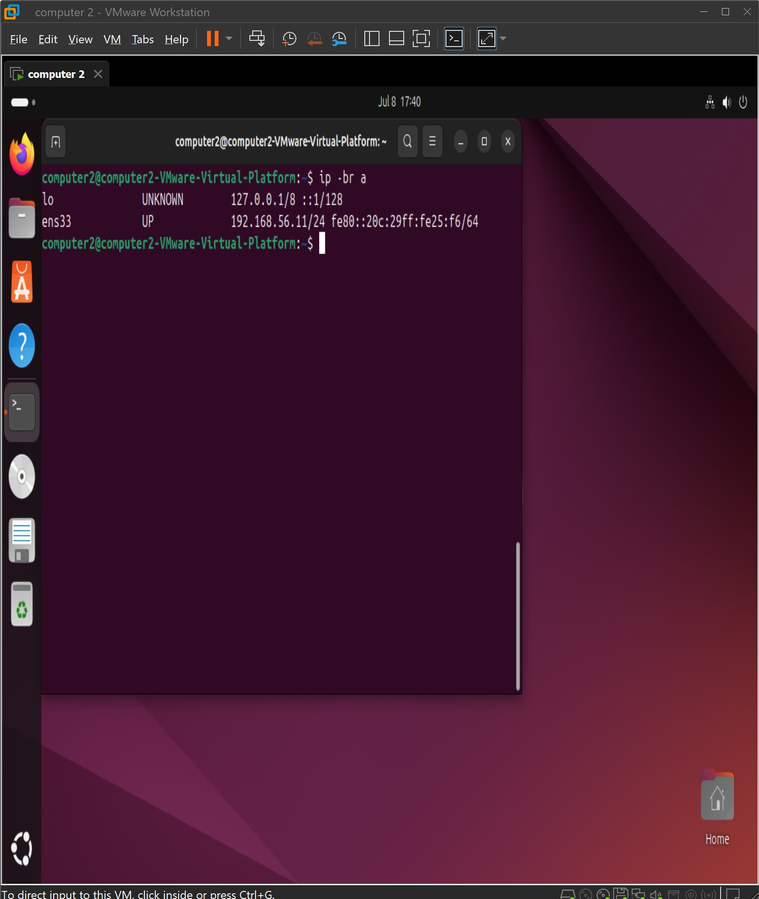

## Successful Pings 
Both ServerVM and ClientVM demonstrate successful internet connectivity. Additionally, bidirectional communication between the VMs is achieved, confirming the network configuration’s effectiveness.
Computer 1 and Computer 2 have internet access:
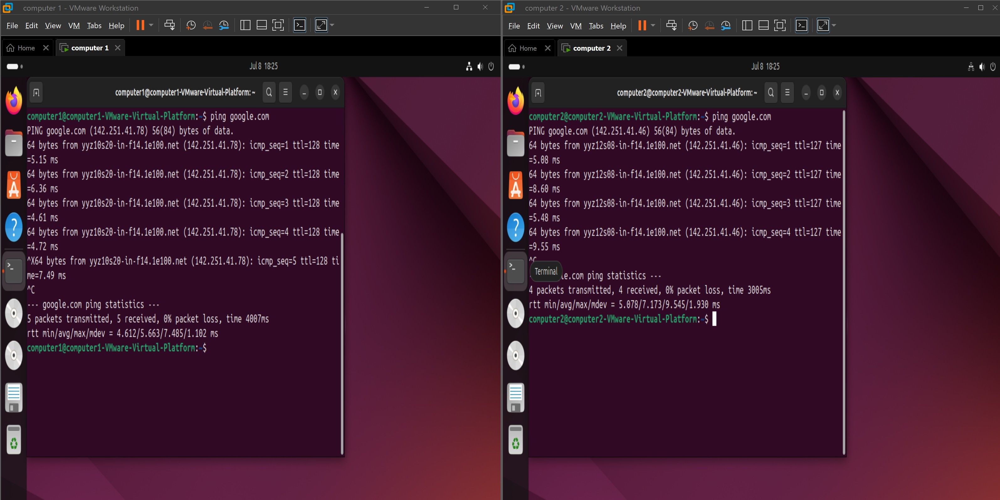
Both computers can ping eachother:
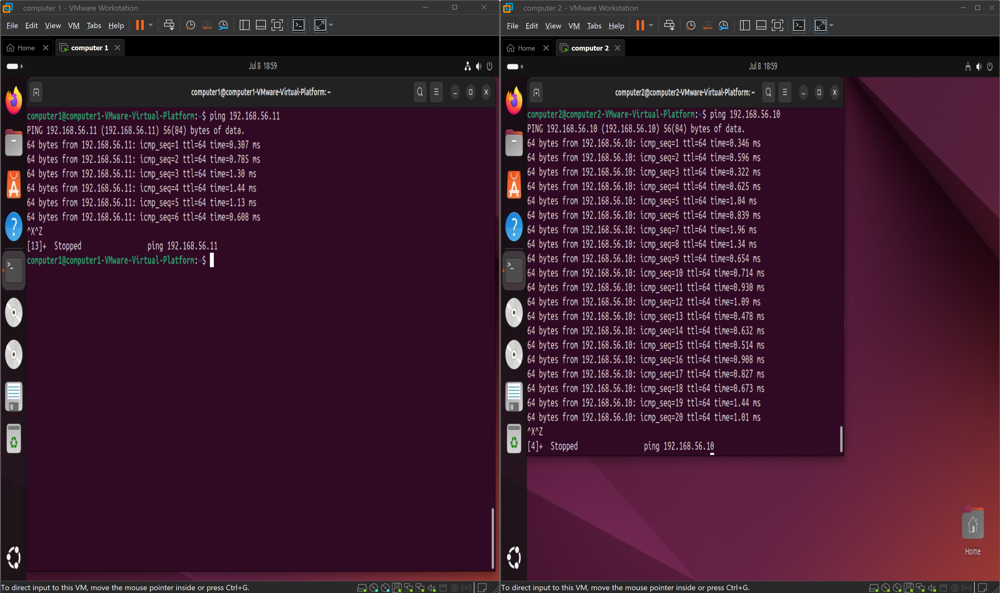

## Conclusion
This project successfully establishes a secure client-server network environment using VMware Workstation/Player, demonstrating fundamental virtualization and networking concepts. ServerVM, configured as the gateway with a NAT interface (ens33) and an internal network interface (ens37) on Custom VMnet2, enables internet access for ClientVM through IP forwarding and NAT masquerading implemented via nftables. Static IP addresses (192.168.56.10 for ServerVM and 192.168.56.11 for ClientVM) were assigned using Netplan, ensuring reliable communication within the internal network. Firewall rules on ServerVM, implemented with nftables, secure the environment by allowing SSH (port 22), HTTP (port 80), and ICMP traffic from ClientVM while maintaining a restrictive policy. ClientVM, configured without firewall rules, relies on ServerVM for routing and connectivity. Persistence scripts on both VMs ensure configurations remain intact across reboots. This setup provides a robust foundation for further exploration of advanced networking scenarios, such as service deployment or security monitoring, enhancing proficiency in network configuration and virtualization.

